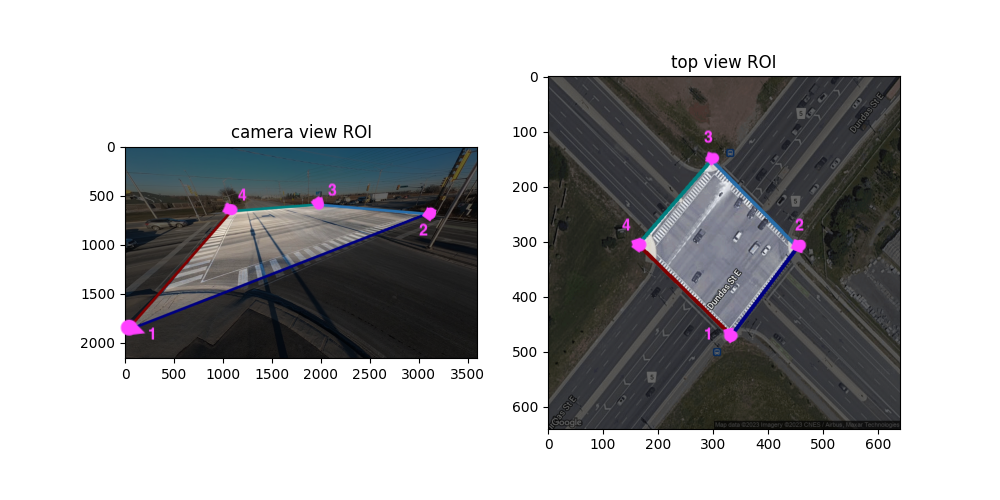

# Counting Guide
This pipeline supports:
  * Categorizing vehicles into 12 categories at Intersections

**NOTE**: before running any functionality of the pipeline makesure to format data according to [our requirements](./).

**NOTE**: there is a full-functionality template in `run.py`.

## Region of Interest (ROI)
Our counting method is mostly based on a manually selected ROI.The ROI is a list of coordinates on a frame of video(image coordinates(x, y)).

ROI should be added in the `<VideoName>.metadata.json`.

To visualize the ROI you can run,
```
python3 main.py --Dataset={src} --VisROI --TopView=<TopView>
```
Results will be stored under src/Results/Visualization/*.[pkl/txt]



To get a consistent result, select the four corners of intersection starting with the south-west corner and continuing counter clock-wise. Following this procedure you will the get the following mapping between MOIs and directions. 

|MOI | Approach | turn|
|--- | -------- | ----|
|1 |South| Left Turn  |
|2 |South| Through    |
|3 |South| Right Turn |
|4 |East | Left Turn  |
|5 |East | Through    |
|6 |East | Right Turn |
|7 |North| Left Turn  |
|8 |North| Through    |
|9 |North| Right Turn |
|10|West | Left Turn  |
|11|West | Through    |
|12|West | Right Turn |

## Prototype Selection
As the first option you can manually select the prototypes for each Movement of Interest.
This command will pop-up a GUI based on QT5 and OpenGL allowing you to label tracks.
```
python3 main.py --Dataset={src}  --Detector={det} --Tracker={tra} --TrackLabelingGUI
```
Results will be stored under src/Results/Annotation/*.mp4

See a sample of working with the GUI below.

[./Assets/ClusterlabellingGUI.mp4](https://github.com/ElderLab-York-University/Transplan/blob/main/Docs/Assets/ClusterLabellingGUISample.mp4)

As an alternative you can select prototypes based on how they interact with ROI.
Simply we have a set of constraints which some tracks pass. We then cluster those tracks based on their starting and ending points.
For automated prototype selection, run
```
python3 main.py --Dataset={src}  --Detector={det} --Tracker={tra} --ExtractCommonTracks\
--ResampleTH=<TH> --TopView=<TopView>
```
Results will be stored under src/Results/Annotation/*.mp4

After prototype selection is completed(by either method), you can run the following to visualize them.
```
python3 main.py --Dataset={src}  --Detector={det} --Tracker={tra} --VisLabelledTrajectories
```
Results will be stored under src/Results/Visualization/*.mp4


## Coutning
To count object one need to set a `--CountMetric={metric}` in the args.
Here is a table of supported metrics. The metrics have two versions, the ones starting with 'g' work on ground plane.
| Metric | Explaination |
| ------ | ------------ |
| "groi" / "roi" | decide based on ROI interactions(eg start point)|
| "gknn" / "knn" | decide based on knn of prototypes |
| "gcos" / "cos" | decide based on angular distance to prototypes|
| "gcmm" / "cmm" | decide based on countur min matching algo|
|"ghausdorff" / "hausdorff"| decide based on hausdorf distance of tarcks to prototypes|
|"gkde" / "kde" | decide based on kernel density estimation of prototypes |

To execute counting you can run,
```
python3 main.py --Dataset={src}  --Detector={det} --Tracker={tra} --Count\
--CountMetric={metric} --ResampleTH=<TH> --TopView=<TopView>
```

To evaluate your counting algorithm you can run,
```
python3 main.py --Dataset={src}  --Detector={det} --Tracker={tra} --EvalCount\
--CountMetric={metric} --ResampleTH=<TH> --TopView=<TopView>
```

There is support for storing the counter for future use. To store a counter from your data you can run,
```
python3 main.py --Dataset={src}  --Detector={det} --Tracker={tra} --Count --CacheCounter\
--CountMetric={metric} --ResampleTH=<TH> --TopView=<TopView>
```

There is support for counter visualization. This is most of the time plotting decisionn boundaries.
You can also visualize how the counter decided for each query track
```
python3 main.py --Dataset={src}  --Detector={det} --Tracker={tra} --CountVisPrompt --CountVisDensity\
--Count --CountMetric={metric} --ResampleTH=<TH> --TopView=<TopView>
```

As a final visualization, you can show counting ids, track ids, and more by running
```
python3 main.py --Dataset={src}  --Detector={det} --Tracker={tra} --CountMetric={met} --VisTrackMoI
```

All of the counting results will be stored under src/Results/Counting/
And visualization results will be stored under src/Results/Visualization/
